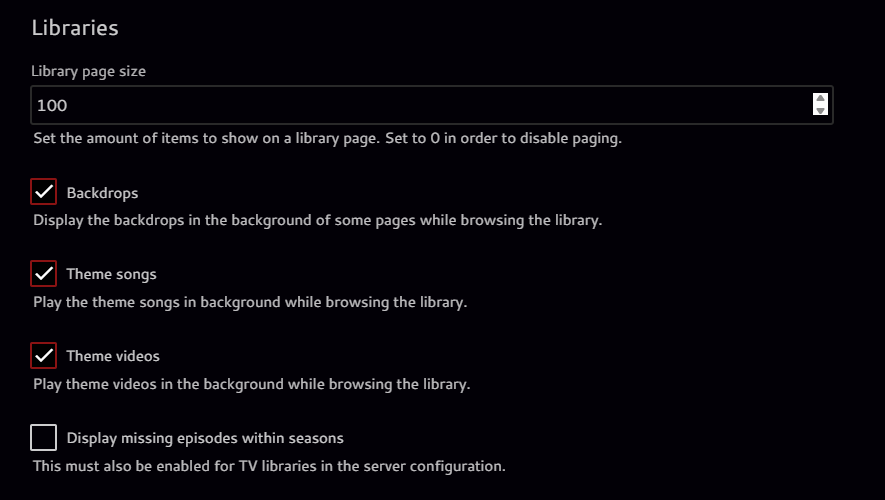

<div align="center">
  <a href="https://github.com/Pukabyte/trailerfin">
    <picture>
      <source media="(prefers-color-scheme: dark)" srcset="assets/logo.png" width="400">
      
    </picture>
  </a>
</div>

<div align="center">
  <a href="https://github.com/Pukabyte/trailerfin/stargazers"></a>
  <a href="https://github.com/Pukabyte/trailerfin/issues"></a>
  <a href="https://github.com/Pukabyte/trailerfin/blob/main/LICENSE"></a>
  <a href="https://github.com/Pukabyte/trailerfin/graphs/contributors"></a>
  <a href="https://discord.gg/vMSnNcd7m5"></a>
</div>

<div align="center">
  <p>Automatically manage IMDb trailers for your media library.</p>
</div>

# Trailerfin

Trailerfin is a tool for automatically retrieving and refreshing IMDb trailer links for your media library as the backdrop video.
Instead of downloading the trailer locally, it will create a .strm file that Jellyfin can use to play the video.  
It will check the expiration of the link and only update when the link has expired.

## Features
- Scans directories for IMDb IDs and updates trailer links
- Fetches the latest trailer or video from IMDb
- Prioritizes trailers over clips when both are available
- Maintains an ignore list for movies without trailers
- Continuous monitoring mode for automatic updates
- Configurable via environment variables
- Docker and Docker Compose support
- Robust logging for monitoring and troubleshooting

## Requirements
- Python 3.11+
- Docker (recommended)
- IMDb IDs in your media folder structure
- Make sure Theme videos are enabled in Settings > Display > Libraies per device
    <picture>
      <source media="(prefers-color-scheme: dark)" srcset="assets/trailerfin.png" width="400">
      
    </picture>

## Setup

### 1. Clone the repository
```sh
git clone https://github.com/Pukabyte/trailerfin.git
cd trailerfin
```

### 2. Configure Environment Variables
Create a `.env` file in the project root with the following variables:

```env
SCAN_PATH=/path/to/your/media
VIDEO_FILENAME=trailer.strm
WORKERS=4
VIDEO_START_TIME=10
```

- `SCAN_PATH`: Directory to scan for IMDb IDs
- `VIDEO_FILENAME`: Name of the .strm file to update
- `WORKERS`: Amount of workers to use
- `VIDEO_START_TIME`: Start time in seconds for the video (default: 10)

### 3. Build and Run with Docker

#### Build the Docker image
```sh
docker build -t trailerfin .
```

#### Run the container
```sh
docker run --env-file .env -v /path/to/your/media:/mnt/plex trailerfin
```

### 4. Using Docker Compose

A sample `docker-compose.yml` is provided:

```yaml
services:
  trailerfin:
    build: .
    container_name: trailerfin
    environment:
      - PUID=1000
      - PGID=1000
      - TZ=Etc/UTC
    volumes:
      - /mnt:/mnt # Make sure this directory is where your content can be found in
      - /opt/trailerfin:/app
      - /etc/localtime:/etc/localtime:ro
    restart: unless-stopped
```

Start with:
```sh
docker-compose up -d
```

## Usage

### Manual Run
```sh
python trailerfin.py --dir /path/to/your/media
```

### Continuous Monitoring Mode (Recommended)
```sh
python trailerfin.py --dir /path/to/your/media --monitor
```
This mode will:
- Continuously monitor for new media
- Check for expiring links
- Automatically refresh links before they expire
- Skip movies without trailers
- Run in the background

## Features in Detail

### Ignore List
- Automatically maintains a list of movies without trailers
- Prevents repeated attempts to fetch non-existent trailers
- Stored in `ignored_titles.json`
- Can be manually edited to retry specific movies

### Video Prioritization
- Prioritizes trailers over clips
- Falls back to clips if no trailer is available
- Ensures best quality video content

### Expiration Management
- Tracks expiration times for all links
- Shows remaining time in minutes and seconds
- Automatically refreshes links before they expire
- Maintains state between runs

## Logging
Logs are output to stdout and can be viewed with Docker logs or Compose logs. The logging includes:
- Link expiration times in readable format
- New media detection
- Ignored titles
- Error handling and troubleshooting information

## License
MIT License 